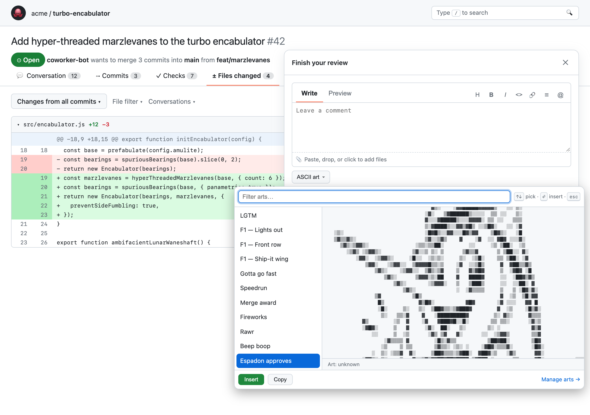

# ASCII Approve

> Let's be honest. Nobody reads pull requests anymore. 
>
> An agent wrote the code, another agent
> reviewed it, a third one wrote the commit message that says `fix: address review feedback`.
>
> You? For now you just click the green button man, for C O M P L I A N C E sake.
>
> So why not do it in style?

**ASCII Approve** is a Chrome extension that adds an **ASCII art ▾** picker to GitHub's
*Finish your review* dialog. 



## What it does

1. You open a PR, go to **Files changed**, click **Submit review**.
2. Below the comment box there's a new button: **ASCII art ▾**.
3. A picker opens. Type to filter, `↑↓` to browse with live preview, `⏎` to insert.
   Or hit **🎲 Random** and let fate decide.
4. The art lands in your comment inside a code fence so GitHub renders it in monospace.
5. You click **Approve**, as nature intended.

## Install

Not on the Chrome Web Store yet. Until then:

1. Clone this repo
2. `chrome://extensions` → enable **Developer mode**
3. **Load unpacked** → select the repo folder
4. Refresh any open GitHub tabs

## Your own arts

Click the extension icon → **+ New art** → paste. Custom arts show up first in the picker and
can be exported/imported as JSON so you can share the pack with your team. Nothing leaves your
browser; the only permission is `storage`.

## Contributing an art

Arts are plain text files in [`arts/`](arts/) plus an entry in
[`arts/manifest.json`](arts/manifest.json). `src/arts.js` is generated.

```bash
# 1. drop the art
$EDITOR arts/my-thing.txt
# 2. add { id, name, tags, credit } to arts/manifest.json
# 3. regenerate
python3 scripts/build_arts.py
```

Rules of the road:

- **Width ≤ 90 columns.** GitHub comments are not that wide. The build script will yell at you.
- **Credit the artist.** Keep signatures (`jgs`, `dwb`, …) inside the art if the original had
  them and fill in `credit`. See [CREDITS.md](CREDITS.md). If you drew it, credit yourself.
- **Keep it approve-shaped.** Celebratory, fast, silly. Nothing you wouldn't want on a company
  PR at 4:59 on a Friday.

## FAQ

**Does this make code review better?**
No.

**Does it work on GitHub Enterprise?**
Not yet — it's pinned to `github.com`. PRs welcome.

**Firefox? Safari?**
Chrome only for now. The code is vanilla MV3 with no build step, so a Firefox port is mostly
a manifest tweak. Safari requires Xcode and a will to live.

**The button isn't showing up.**
Hard-refresh the PR tab after installing/reloading the extension. Still nothing? Open devtools
and look for `[ascii-approve]` lines in the console, then open an issue with what you see.

**Why?**
Someone had to.

## Credits

See [CREDITS.md](CREDITS.md). Most of these arts are decades-old Usenet folk art by people who
were very good at drawing with a keyboard. Text banners are [figlet](http://www.figlet.org/) fonts.

## License

MIT. The extension code, that is — the arts belong to their artists.
